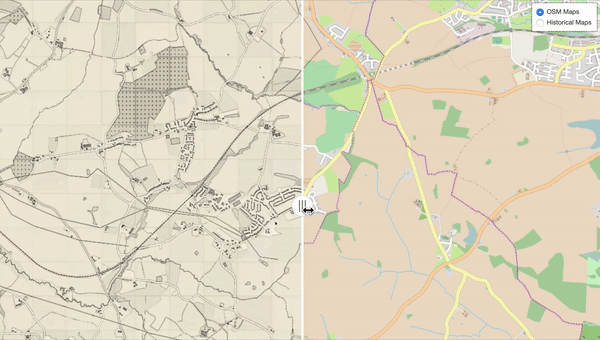

# Map Side-by-side

Demo to show the map synthesis using cycle-GAN to convert open street map (OSM) images into historical map style. The historical map dataset used for training is downloaded from National Library of Scotland ([NLS](https://maps.nls.uk/)) website. 

This demo provides two radio buttons to toggle between two views. The first view compares the synthesized historical map with the input OSM map, and the second view compares the synthesize map with authentic historical maps.

